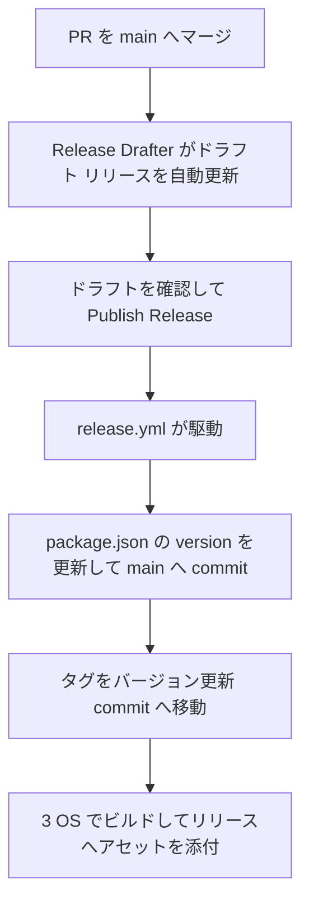

# リリース フロー

Parade のリリースと公開の運用手順です。GitHub の無償機能 (Releases / Actions / Release Drafter) だけで構成しています。

## 全体の流れ

1. PR を main へマージすると [Release Drafter](https://github.com/release-drafter/release-drafter) (`.github/workflows/release-drafter.yml`) が次リリースのドラフトを自動更新する
   - タイトル・タグは解決済みの次バージョン (例: `v1.0.1`)
   - Release Notes にはマージ済み PR がカテゴリー別に列挙される
2. リリースしたいタイミングで GitHub の Releases ページからドラフトを開き、内容を確認・編集して **Publish release** する
3. Publish を契機に `release.yml` が自動実行される
   - `version` job: タグからバージョンを取り出し、`package.json` の `version` を更新して main へ commit (`chore: vX.Y.Z`)。Publish 時に打たれたタグをこの commit へ移動する
   - `build` job: macOS / Windows / Linux の 3 OS でパッケージをビルドし、リリースへアセットを添付する

リリース作業として人間が行うのは **PR のマージ**と**ドラフトの Publish** だけです。

## バージョンの制御

バージョンは [Semantic Versioning](https://semver.org/lang/ja/) (`vMAJOR.MINOR.PATCH`) で、Release Drafter が **PR のラベル**から次バージョンを解決します。

| 更新     | 方法                                     |
| -------- | ---------------------------------------- |
| Patch    | 何もしない (ラベルなしのデフォルト)      |
| Minor    | PR に `release:minor` ラベルを付与する   |
| Major    | PR に `release:major` ラベルを付与する   |

- ドラフトに含まれる PR に複数の `release:*` ラベルがある場合は、最も大きい更新が優先される (Major > Minor > Patch)
- ラベルの付与はマージ後でもよい (ドラフトは PR ラベルの変更でも再計算される)

### 任意のバージョンにしたい場合

`release.yml` は **Publish されたリリースのタグ名**からバージョンを取得します。そのため、ドラフトのタグとタイトルを Publish 前に手動で書き換えれば、ラベルによらず任意のバージョン (例: `v2.0.0`) でリリースできます。タグは `vX.Y.Z` 形式であることが必須です (形式が不正な場合、ワークフローは失敗します)。

### 初回リリースは v1.0.0 に書き換える

過去に Publish されたリリースが存在しない場合、Release Drafter は基準バージョンを `0.0.0` として扱うため、初回ドラフトのタグは `v0.0.1` になります (package.json の `version` は参照されません)。初回リリースは上記の手順でタグとタイトルを `v1.0.0` へ書き換えてから Publish してください。以降のドラフトは公開済みの最新リリースを基準に解決されるため、書き換えは初回だけで済みます。

## PR ラベルの運用

Release Notes のカテゴリー分類には既存のラベルを使用します。

| ラベル     | カテゴリー       |
| ---------- | ---------------- |
| `feat`     | 🚀 New Features   |
| `fix`      | 🐛 Bug Fixes      |
| `refactor` | ♻️ Refactoring    |
| `docs`     | 📝 Documentation  |
| `chore`    | 🔧 Maintenance    |

ブランチ名の接頭辞 (`feat/`, `fix/`, `refactor/`, `docs/`, `chore/`) から autolabeler が PR へ自動付与するため、通常は手動での付与は不要です。

バージョン制御用のラベルは次の 2 つです (autolabeler の対象外、必要なときに手動で付与)。

| ラベル          | 意味                     |
| --------------- | ------------------------ |
| `release:major` | 次リリースを Major 更新  |
| `release:minor` | 次リリースを Minor 更新  |

## 公開されるアセット

`electron-builder.yml` の設定に基づき、以下がリリースへ添付されます。ファイル名は `Parade-<version>-<os>-<arch>.<ext>` です。

| OS      | 形式           |
| ------- | -------------- |
| macOS   | dmg, zip       |
| Windows | nsis (exe), zip |
| Linux   | AppImage, deb  |

最新版へのリンクは常に <https://github.com/akabekobeko/music-player/releases/latest> で参照できます。過去バージョンのアセットも削除せず残します (public リポジトリーのリリース アセットは容量無制限・無料。1 ファイル 2 GiB の上限のみ)。

## 注意事項

- **バージョン更新 commit は bot が main へ直接 push する**
  - `github-actions[bot]` 名義の `chore: vX.Y.Z` commit が main へ入る (main が branch protection されていないことが前提)
  - `GITHUB_TOKEN` による push は他のワークフローをトリガーしないため、この commit で CI は実行されない
- **タグは Publish 後に移動される**
  - Publish 時点では main の HEAD にタグが打たれ、その後 `version` job がバージョン更新 commit へ force 移動する。タグの位置は最終的に `package.json` の version と一致した状態になる
- **リリースが失敗した場合は Actions から再実行する**
  - `version` job はバージョンが一致していれば commit をスキップし、アセットは `--clobber` で上書きされるため、再実行は冪等
- **バイナリーは未署名**
  - macOS: Gatekeeper にブロックされるため、初回起動はアプリを右クリック →「開く」(または `xattr -d com.apple.quarantine`) が必要
  - Windows: SmartScreen の警告が出るため「詳細情報」→「実行」で起動する
  - コード署名 (Apple Developer Program、コードサイニング証明書) は有償のため、無償運用の間はこの案内で対応する
